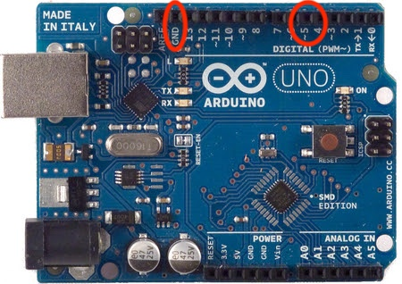
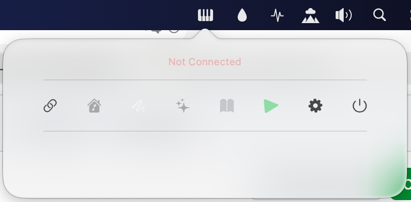

# PianoLED

PianoLED is a project that integrates LED strip visualization with a piano, allowing real-time light effects triggered by MIDI input. This project has been tested on Arduino Uno R3 (Tahoe 26).

# Features
- Real-time LED response to MIDI notes
- Supports multiple LED patterns and modes via companion app:
  - Manual Picker Mode – select LED colors manually
  - Random Colors Mode – LEDs display random colors automatically
  - Brightness Control – adjust LED brightness
  - Learning Mode – visualize notes while learning piano
  - MIDI Files Manager Controller – manage MIDI files for Learning Mode
  - Sync Baudrate – configure communication speed between Arduino and app

# Hardware
- LED Strip: WS2812b (144led/meter) or similar addressable LED strips
- Microcontroller: Arduino Uno R3 (currently tested)
- Power Supply: External 5V power for LED strip recommended
- MIDI Input: Standard MIDI input from piano or controller

# Software
- Arduino IDE for uploading firmware
- Companion app with modes listed above for controlling LED behavior

# Installation
1. Connect :
   - Connect your Arduino Uno R3 to your Mac Os via USB
   - Connect LED strip via Arduino Uno R3 by 2 jumper wire (Gnd, data_pin 5) (image 1)
   - Connect LED strip via an external 5v power supply
2. Upload the `PianoLED.ino` sketch to your board
3. Run the app, configure settings (baud rate, midi device, serial port), click connect button, select a mode, and control the LEDs (image 2)
4. Play your MIDI deivce and watch the LEDs light up in sync with your notes

# Images

  1. 
  2. 

# Usage
- Configure LED mapping in the code (`PianoLED.ino`)
- Select app mode (Manual Picker, Random Colors, Learning, etc.)
- Adjust brightness and other settings

# Contributing
Contributions are welcome! Feel free to open issues or submit pull requests to improve the project.

# License
This project is licensed under the MIT License. See the LICENSE file for details.
